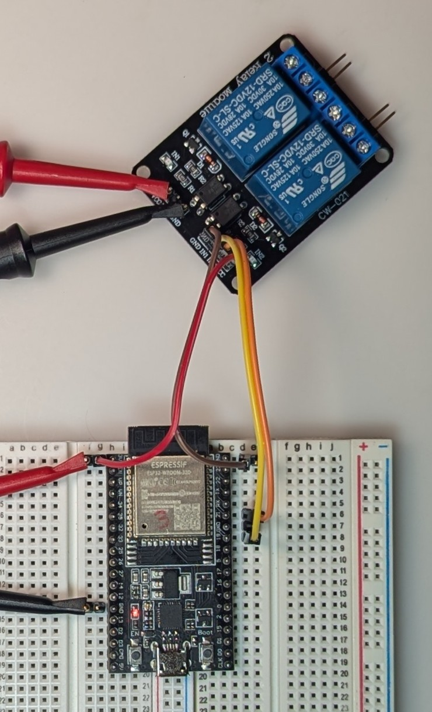
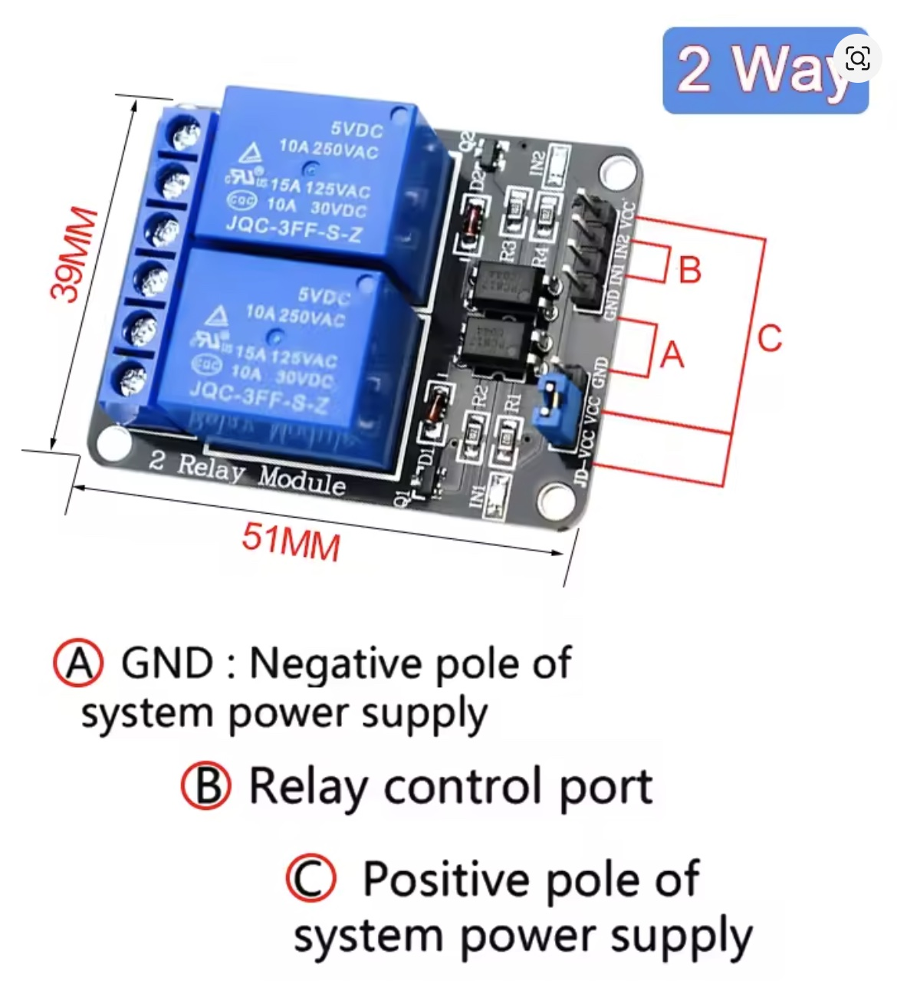

# Wiring Diagram for ESP32 Dual Garage Door Opener

## Component Overview

This project uses an ESP32 to control two garage doors via a dual-channel relay module that simulates button presses on the garage door controllers.

## Wiring Setup Reference

*ESP32 development board connected to dual-channel relay module. The pins at the upper right connect in parallel to the garage door button wires.*

## Relay Module Reference

*Typical 2-channel relay module with screw terminals for garage door connections*

## Detailed Connection Guide

### ESP32 to Relay Module Connections

| ESP32 Pin | Relay Module Pin | Description |
|-----------|------------------|-------------|
| GPIO 19   | IN1              | Control signal for Door 1 |
| GPIO 21   | IN2              | Control signal for Door 2 |
| 5V/3.3V   | VCC              | Power supply (check relay module specs) |
| GND       | GND              | Common ground |

### Relay Module to Garage Door Controller

| Relay Module | Garage Door Button | Connection |
|--------------|-------------------|------------|
| Relay 1 COM  | Door 1 Terminal 1 | Common connection |
| Relay 1 NO   | Door 1 Terminal 2 | Normally Open contact |
| Relay 2 COM  | Door 2 Terminal 1 | Common connection |
| Relay 2 NO   | Door 2 Terminal 2 | Normally Open contact |

## Relay Module Specifications

- **Type**: Dual-channel Normally Open (NO) relay module
- **Control Voltage**: 5V or 3.3V (check your module)
- **Switching Current**: Minimum 10mA
- **Contact Rating**: 10A @ 120V AC (for garage door controller)
- **Isolation**: Optoisolated (recommended for safety)

## Operation Sequence

1. **Idle State**: 
   - GPIO 19 and GPIO 21 are HIGH
   - Relays are open (NO contacts disconnected)
   - Garage doors remain in current state

2. **Door Activation**:
   - GPIO pin goes LOW for 500ms
   - Relay closes (NO contacts connect)
   - Garage door controller receives button press signal
   - GPIO returns to HIGH
   - Relay opens (NO contacts disconnect)

3. **Door Movement**:
   - If door is closed → opens
   - If door is open → closes
   - If door is moving → stops

## Safety Considerations

- **Isolation**: Use relay modules with optoisolation to protect ESP32
- **Testing**: Always test with multimeter before connecting to garage door system
- **Fuses**: Consider adding appropriate fuses for additional protection
- **Voltage**: Ensure relay module voltage matches ESP32 output (3.3V or 5V)
- **Current**: Verify relay can handle garage door controller current requirements

## Troubleshooting

- **Door doesn't respond**: Check relay connections and garage door button terminals
- **ESP32 resets**: Verify power supply can handle relay module current draw
- **Intermittent operation**: Check for loose connections or poor grounding
- **Wrong door activates**: Verify GPIO pin assignments match relay connections
